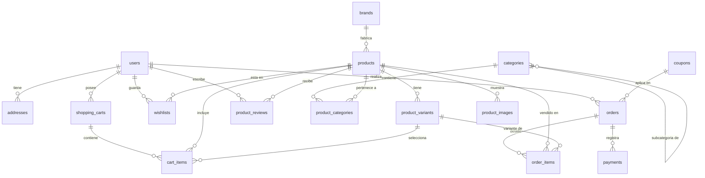

# Base de Datos para E-Commerce (PostgreSQL)

Diseño de base de datos relacional para una plataforma de comercio electrónico típica, escalable y lista para producción en **PostgreSQL**.

---

## 📌 Estructura y Entidades

El modelo cubre todo el flujo operativo de una tienda en línea:

1. **Usuarios y Autenticación**:
   - `users`: Clientes, administradores y moderadores con control de roles (`user_role`).
   - `addresses`: Múltiples direcciones de envío y facturación por usuario.

2. **Catálogo de Productos**:
   - `brands`: Marcas comerciales.
   - `categories`: Categorías con estructura en árbol/jerarquía (padre-hijo).
   - `products`: Ficha técnica, precios, stock general, SKU y control de visibilidad.
   - `product_categories`: Relación N:M para productos en múltiples categorías.
   - `product_variants`: Variantes por color, talla, almacenamiento, etc., con stock individual y atributos `JSONB`.
   - `product_images`: Galería multimedia con orden de visualización e imagen principal.

3. **Interacción del Cliente**:
   - `shopping_carts` y `cart_items`: Carritos persistentes para usuarios registrados e invitados (`session_token`).
   - `wishlists`: Lista de productos favoritos del cliente.
   - `product_reviews`: Reseñas, puntuación (1 a 5 estrellas) y verificación de compra (`is_verified_purchase`).

4. **Ventas y Facturación**:
   - `coupons`: Cupones de descuento (porcentaje o monto fijo) con vigencia y topes.
   - `orders`: Encabezado del pedido, cálculo de subtotales, impuestos, descuentos y snapshot inmutable de direcciones (`JSONB`).
   - `order_items`: Detalle de los productos/variantes comprados congelando su precio en el momento de la compra.
   - `payments`: Registro de transacciones con pasarelas de pago (Stripe, PayPal, MercadoPago, etc.) y payload de respuesta (`JSONB`).

---

## 🗺️ Diagrama Entidad-Relación



---

## 🚀 Cómo Ejecutar los Scripts

### Opción A: Desde Terminal (`psql`)

1. Crear la base de datos:
   ```bash
   createdb ecommerce_db
   ```
2. Ejecutar el esquema y las tablas:
   ```bash
   psql -d ecommerce_db -f schema.sql
   ```
3. (Opcional) Cargar datos de prueba:
   ```bash
   psql -d ecommerce_db -f seed.sql
   ```

### Opción B: Usando Docker

```bash
# Levantar PostgreSQL 16
docker run --name ecommerce-postgres \
  -e POSTGRES_DB=ecommerce_db \
  -e POSTGRES_USER=postgres \
  -e POSTGRES_PASSWORD=postgres \
  -p 5432:5432 -d postgres:16-alpine

# Ejecutar el esquema
docker exec -i ecommerce-postgres psql -U postgres -d ecommerce_db < schema.sql
docker exec -i ecommerce-postgres psql -U postgres -d ecommerce_db < seed.sql
```

### Opción C: Desde pgAdmin o DBeaver
1. Abre tu cliente SQL favorito y conéctate a tu base de datos PostgreSQL.
2. Abre y ejecuta el archivo [`schema.sql`](file:///c:/Users/VI-Alumno/Desktop/e-commerce/schema.sql).
3. Abre y ejecuta el archivo [`seed.sql`](file:///c:/Users/VI-Alumno/Desktop/e-commerce/seed.sql).

---

## 💡 Consultas SQL Comunes

### 1. Listar productos con su marca, categoría y variantes disponibles
```sql
SELECT 
    p.name AS producto,
    b.name AS marca,
    p.base_price AS precio_base,
    p.discount_price AS precio_oferta,
    COALESCE(json_agg(json_build_object(
        'sku', pv.sku,
        'variante', pv.variant_name,
        'stock', pv.stock_quantity,
        'atributos', pv.attributes
    )) FILTER (WHERE pv.id IS NOT NULL), '[]'::json) AS variantes
FROM products p
LEFT JOIN brands b ON p.brand_id = b.id
LEFT JOIN product_variants pv ON p.id = pv.product_id AND pv.is_active = true
WHERE p.is_active = true
GROUP BY p.id, b.name;
```

### 2. Obtener el carrito actual de un usuario con detalles y precios
```sql
SELECT 
    ci.id AS item_id,
    p.name AS producto,
    pv.variant_name AS variante,
    (p.base_price + COALESCE(pv.price_modifier, 0)) AS precio_unitario,
    ci.quantity AS cantidad,
    (p.base_price + COALESCE(pv.price_modifier, 0)) * ci.quantity AS subtotal
FROM shopping_carts sc
JOIN cart_items ci ON sc.id = ci.cart_id
JOIN products p ON ci.product_id = p.id
LEFT JOIN product_variants pv ON ci.variant_id = pv.id
WHERE sc.user_id = 'c0eebc99-9c0b-4ef8-bb6d-6bb9bd380a33';
```

### 3. Reporte de pedidos completados con métodos de pago y totales
```sql
SELECT 
    o.order_number,
    u.email AS cliente,
    o.status AS estado_pedido,
    o.total_amount,
    p.payment_method,
    p.payment_status,
    o.created_at
FROM orders o
JOIN users u ON o.user_id = u.id
LEFT JOIN payments p ON o.id = p.order_id
ORDER BY o.created_at DESC;
```
